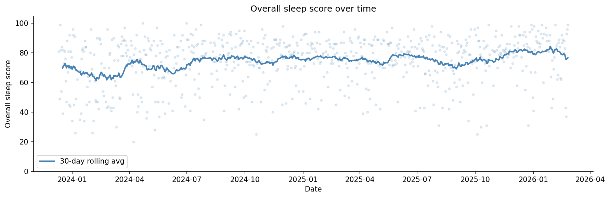
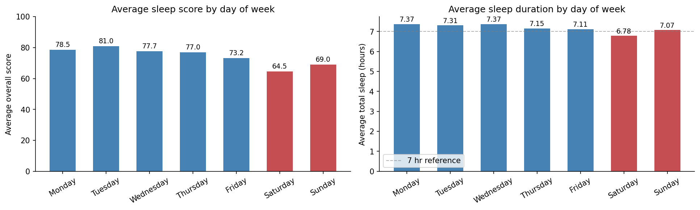
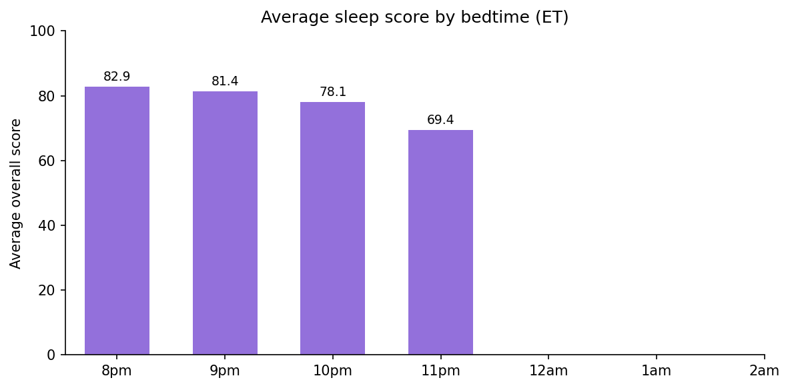

# Garmin Sleep Analysis

Exploratory analysis of 2+ years of personal sleep data exported from a Garmin watch via Garmin Connect.

The goal is to identify patterns in sleep quality, duration, and stage composition over time using data I collected through my Garmin watch.

---

## Data

Data was exported directly from [Garmin Connect](https://www.garmin.com/en-US/account/datamanagement/exportdata) as JSON files. The raw exports cover **December 2023 through February 2026** and contain nightly records with sleep stage breakdowns, Garmin's proprietary sleep scores, respiration rates, stress levels, and qualitative feedback labels.

> **Note:** Raw data files are not included in this repository as they contain personal health information. If you want to replicate this project with your own data, you can export your sleep history from Garmin Connect under **Account > Data Management > Export Your Data**.

---

## Pipeline

The project will be structured as a sequential three-notebook pipeline:

| Notebook | Status | Purpose |
|---|---|---|
| `01_sleep_concat.ipynb` | ✅ Complete | Load and combine raw JSON files |
| `02_sleep_clean.ipynb` | ✅ Complete | Clean and transform the combined data |
| `03_sleep_analysis.ipynb` | ✅ Complete | Exploratory analysis and visualizations |

---

## notebooks/01_sleep_concat.ipynb

Loads all 9 raw sleep JSON files and combines them into a single table of 800 nightly records.

The only transformation applied at this stage is flattening Garmin's nested `sleepScores` sub-object into individual columns. Everything else — the raw field names, original units, empty rows, and all columns — is preserved exactly as exported. All cleaning decisions are deferred to the next notebook.

**Output:** `sleep_concat.csv` — 800 rows, 31 columns

## notebooks/02_sleep_clean.ipynb

Cleans and transforms the raw concatenated data. Drops 69 empty rows (nights the watch wasn't worn), converts sleep stage durations from seconds to minutes, parses timestamps, derives time-based columns, and standardizes all column names to snake_case. Also flags nap days and extracts sentiment from Garmin's feedback labels.

**Input:** `sleep_concat.csv` — 800 rows, 31 columns
**Output:** `sleep_clean.csv` — 731 rows, 36 columns

## notebooks/03_sleep_analysis.ipynb

Exploratory analysis of the cleaned dataset. Covers sleep score and duration trends over time, stage composition, day-of-week patterns, Garmin feedback label breakdowns, nap day comparisons, and the relationship between bedtime and sleep quality.

**Inputs:** `sleep_clean.csv` — 731 rows, 36 columns

---

## Key Findings

- **Consistent overall.** An average score in the mid-70s and just over 7 hours of sleep per night, sustained across the full tracking period. No dramatic long-term trends up or down.

- **Weekends are worse.** Lower scores and shorter duration on Saturdays and Sundays — not surprising, but the data confirms it.

- **Bedtime matters.** Later bedtimes correlate with lower sleep scores. Going to bed at 10pm vs 11pm is associated with almost a 10-point difference in overall score.

---

## Stack

- Python 3
- pandas
- matplotlib
- Jupyter Notebook

---